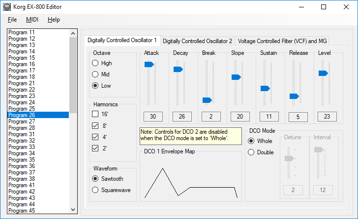
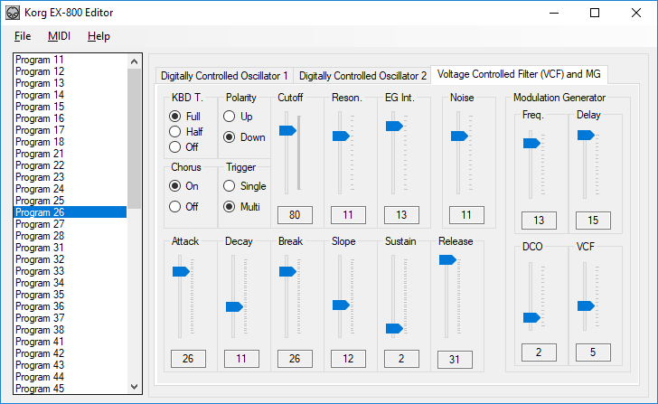
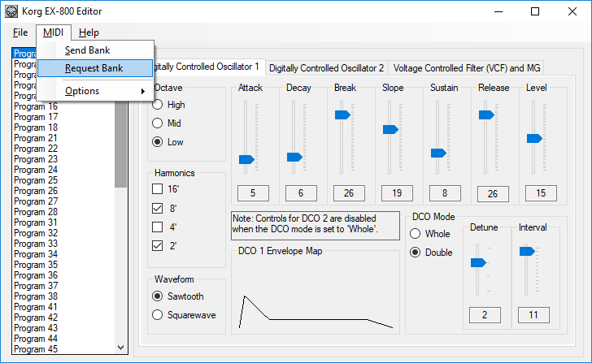
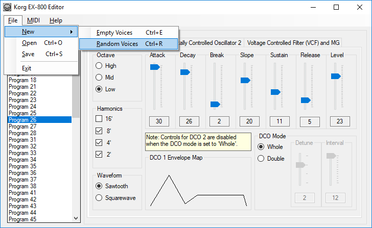

# Korg EX-800 Editor

This application is a GUI-based Editor/Librarian for the Korg EX-800 Synthesizer that is written in C# and .NET. (I would imagine that it might work with the Korg Poly 800 as well, but I have not tested it.)

This editor/librarian does *not* support the features that are provided through the "HAWK-800" kit. (<http://www.hawk800.com/>)

## Dependencies

Note that it has a dependency on Leslie Sanford's [C# MIDI toolkit (Sanford.Multimedia.Midi)](https://github.com/tebjan/Sanford.Multimedia.Midi), which you can install using Package Manager:

```
Install-Package Sanford.Multimedia.Midi
```

## Screenshots

The main window of the application looks like the following illustration, where you can select the voice to edit, modify the parameters for the Digitally-Controlled Oscillators (DCOs), and view a graphic representation of the Envelope Generators (EGs):



On a separate tab, you can edit the parameters for the Voltage Controlled Oscillator (VCF) and Modulation Generator (MG):



From the **MIDI** menu, you can send and receive banks of voices to/from your EX-800:



And you can also use the application to create banks of random voices:


